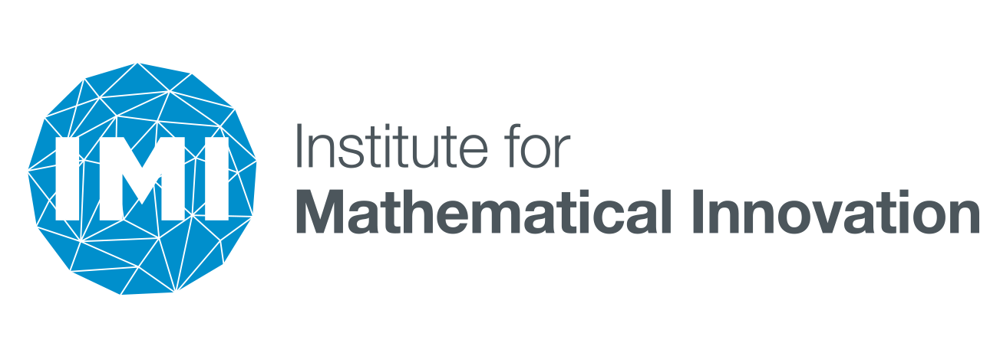
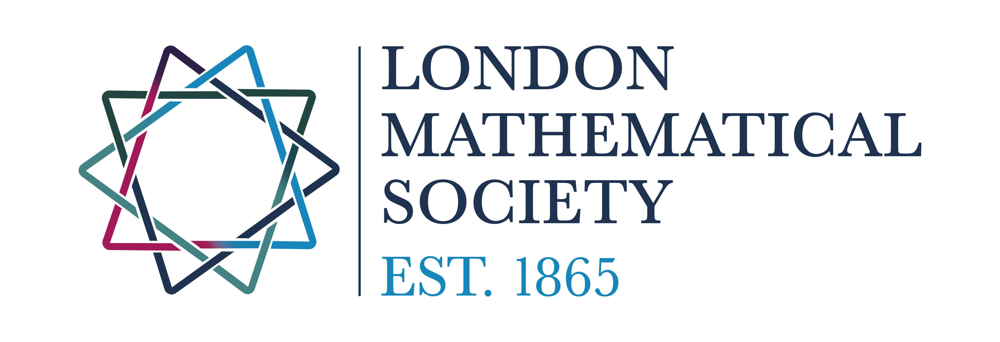

 

# Scope
Machine Learning (ML) can described as statistical and numerical methods which underpin modern algorithms for detecting patterns and inference. A common theme to many activities in ML today is that mathematical models based on sample data are used to train algorithms to work on real data. Applications include self-driven cars, fraud detection, and recommendations on online shops like Amazon. ML is an emerging field in mathematics, combining hitherto largely separated branches of mathematics under one roof, such as variational methods, numerical analysis and statistics. The conference will bring together people working in approximation theory, inverse problems, optimal transport, multi-scale analysis and statistics, for example. 
 
ML is currently undergoing a massive expansion, due to the unprecedented availability of large amounts of data. The data explosion requires new fast and efficient classification methods. Image recognition is a classic example, where the aim is to train computers so that they can automatically detect and differentiate the content, say separate pictures of cats from pictures of dogs. Therefore it is sometimes said that an ML revolution is  underway, which is transforming our society. The last decade has seen tremendous improvements by ML in application areas ranging from (bio-) medical sciences, computer vision and finance to name a few. Nowadays ML solutions are deployed on mobile phones such that ML impacts all of our lives. 
  
Remarkably, while ML relies on mathematical models and tools, many ML algorithms are not well understood mathematically. One reason for this is that ML has been historically developed as a subfield of computer science and not mathematics. Fundamental questions are open, such as convergence and convergence rates, or the topology and geometry with which data should be studied. It is important for the mathematical community that mathematics claims its share of ML, and provides a solid underpinning of the ML methods that surround us in daily life. This conference will advocate the connection of many mathematical disciplines like numerical analysis, inverse problems, optimisation, statistics, optimal transport, dynamical systems, partial differential equations to ML. By bringing together world-leading mathematicians, statisticians and data scientists to discuss recent developments in the fundamental understanding of ML we aim to shed light into the mysterious pathways of ML.

# Invited Speakers
- [Jonas Adler](https://jonasadler.com/), Google DeepMind, UK
- [Simon Arridge](http://www0.cs.ucl.ac.uk/staff/S.Arridge/), University College London, UK
- [Martin Benning](https://www.qmul.ac.uk/maths/profiles/benningmartin.html), Queen Mary University of London, UK
- [Elena Calledoni](https://www.ntnu.edu/employees/elena.celledoni), Norwegian University of Science and Technology, Norway
- [Coralia Cartis](http://people.maths.ox.ac.uk/cartis/), University of Oxford, UK
- [Yujie Chi](https://users.ece.cmu.edu/~yuejiec/), Carnegie Mellon University, USA
- [Lénaïc Chizat](https://lchizat.github.io/), Laboratoire de Mathématiques d'Orsay, France
- [Stephane Chretien](https://sites.google.com/site/stephanegchretien/home), University of Lyon, France
- [Weinan E](https://web.math.princeton.edu/~weinan/), Princeton University, USA
- [Alhussein Fawzi](http://www.alhusseinfawzi.info/), Google DeepMind, UK
- [Andrew Fitzgibbon](https://www.microsoft.com/en-us/research/people/awf/), Microsoft Research, UK
- [Kerstin Hammernik](https://biomedia.doc.ic.ac.uk/person/kerstin-hammernik/), Imperial College London, UK
- [Anders Hansen](http://www.damtp.cam.ac.uk/research/afha/anders/), University of Cambridge, UK
- [Benedict Leimkuhler](http://kac.maths.ed.ac.uk/~bl), University of Edinburgh, UK
- [Sofia Olhede](https://people.epfl.ch/sofia.olhede?lang=en), EPFL, Switzerland
- [Brynjulf Owren](https://www.ntnu.edu/employees/brynjulf.owren), Norwegian University of Science and Technology, Norway
- [Marcelo Pereyra](https://www.macs.hw.ac.uk/~mp71/about.html), Heriot-Watt University, UK
- [Philipp Petersen](http://www.pc-petersen.eu/), University of Vienna, Austria
- [Johannes Schmidt-Hieber](https://wwwhome.ewi.utwente.nl/~schmidtaj/), University of Twente, Netherlands
- [Aretha Teckentrup](https://www.maths.ed.ac.uk/~ateckent/), University of Edinburgh, UK
- [Spencer Thomas](https://www.npl.co.uk/people/spencer-thomas), National Physical Laboratory, UK
- [Matthew Thorpe](http://www.damtp.cam.ac.uk/people/mt748/), University of Manchester, UK
- [Ivan Tyukin](https://www2.le.ac.uk/departments/mathematics/extranet/staff-material/staff-profiles/it37), University of Leicester, UK
- [Pierfrancesco Urbani](https://scholar.google.co.uk/citations?user=tV7pohwAAAAJ&hl=en), Université Paris-Saclay, France
- [Jong Chul Ye](https://bispl.weebly.com/professor.html), KAIST, Korea

# Organisers
- [Philip Aston](https://www.surrey.ac.uk/people/philip-aston), University of Surrey, UK
- [Matthias J. Ehrhardt](https://mehrhardt.github.io/), University of Bath, UK
- [Catherine Higham](https://www.gla.ac.uk/schools/computing/staff/catherinehigham/), University of Glasgow, UK
- [Clarice Poon](http://www.damtp.cam.ac.uk/user/cmhsp2/), University of Bath, UK

# Call for contributions
We are accepting contributions for posters. Please submit 1 page abstracts [here](https://docs.google.com/forms/d/e/1FAIpQLSdXYTucpfDubVkalV2ZbC7Qln0h__O692iHcsJOyc9R2KpAEw/viewform). If you wish to attend this meeting but do not want to present a poster, then please sign up [here](https://docs.google.com/forms/d/e/1FAIpQLSdUnm5s_QROWRn5PQVYOFzD1XtNf8kBFwtCD3d6qyhFjcPnoA/viewform). Note, however, that due to space limitations, we will give priority to those who offer to present posters.

Deadline: 13th March 2020 
Notification of acceptance: 10th April 2020

# Contact
Contact the organisers: [MathML2020@bath.ac.uk](MathML2020@bath.ac.uk)

# Sponsors
- [Institute for Mathematical Innovation (IMI)](https://www.bath.ac.uk/research-institutes/institute-for-mathematical-innovation/)
- [London Mathematical Society (LMS)](https://www.lms.ac.uk/)

- [Statistical Applied Mathematics at Bath (SAMBa)](http://www.bath.ac.uk/centres-for-doctoral-training/epsrc-centre-for-doctoral-training-in-statistical-applied-mathematics-samba/)

 
{:height="150px"}
{:height="150px"}
